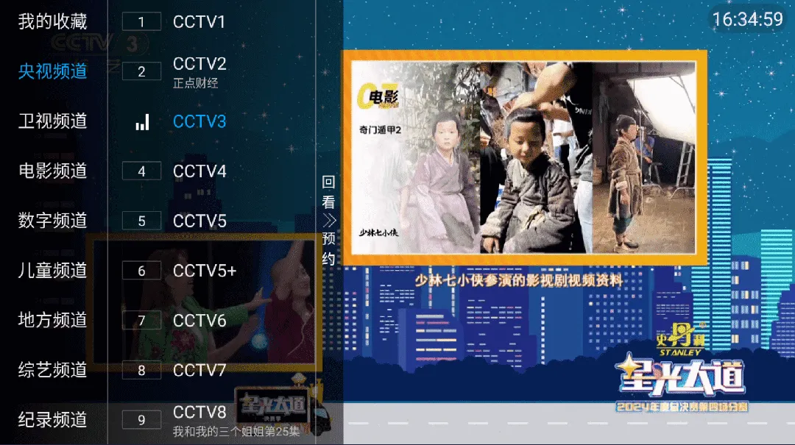

<h2 align="center">✯ 以下是来自原项目的推荐，如有疑问可直接联系原想项目作者＜（＾－＾）＞ ✯</h2>

<h2 align="center">✯ 这是一个国内可直连的iptv直播源分享项目 ✯</h2>

<h2>🔄永久免费 完全开源 不含广告 直播源支持IPv4/IPv6双栈访问🔄</h2>

<span style="color: #e03e2d;"><strong>请注意：</strong></span>本仓库直播源全部来源：由github仓库工作流自动收集于网络公开资源。本项目不存储任何直播源媒体的内容，所有直播源均由第三方提供，本项目不对其内容负责，不保证直播源的可用性、稳定性和合法性。


如不愿折腾开源项目，推荐直接下载第三方开发的软件 **直播电视** APP 使用，手机电视盒子都兼容，免费无广告。

直播电视APP 下载地址：[https://izbds.com/aztv/](https://izbds.com/aztv/)    

------


<h2>📡 自动扫描直播源 IPTV4</h2>

<p><strong>IPTV4直播源</strong>由部署在服务器上的程序自动扫描验证，确保<strong>直播源</strong>的时效性和稳定性。</p>

<!-- UPDATE_TIME_IPTV4 -->本次更新时间: 2026-06-21 18:26:29<!-- END_UPDATE_TIME_IPTV4 -->

<table>
  <colgroup>
    <col style="width: 20%;">
    <col style="width: 60%;">
    <col style="width: 20%;">
  </colgroup>
  <tr>
    <th>名称</th>
    <th>网址</th>
    <th>快速复制</th>
  </tr>
  <tr>
    <td>TXT 格式直播源</td>
    <td><a href="https://live.zbds.top/tv/iptv4.txt">https://live.zbds.top/tv/iptv4.txt</a></td>
    <td><button class="button" onclick="copyToClipboard('https://live.zbds.top/tv/iptv4.txt')">快速复制</button></td>
  </tr>
  <tr>
    <td>M3U 格式直播源（已带台标和EPG）</td>
    <td><a href="https://live.zbds.top/tv/iptv4.m3u">https://live.zbds.top/tv/iptv4.m3u</a></td>
    <td><button class="button" onclick="copyToClipboard('https://live.zbds.top/tv/iptv4.m3u')">快速复制</button></td>
  </tr>
</table>
*如果你打不开github域名，请使用加速地址访问，加速地址也失效了？那就在找一个*

```
https://gh-proxy.com/raw.githubusercontent.com/vbskycn/iptv/refs/heads/master/tv/iptv4.txt
```

```
https://gh-proxy.com/raw.githubusercontent.com/vbskycn/iptv/refs/heads/master/tv/iptv4.m3u
```


<h2>📡 自动扫描直播源 IPTV6</h2>

<p><strong>IPTV6直播源</strong>专为IPv6网络优化，由部署在服务器上的程序自动扫描验证，确保<strong>直播源</strong>的时效和稳定</p>

<!-- UPDATE_TIME_IPTV6 -->本次更新时间: 2026-06-21 18:26:29<!-- END_UPDATE_TIME_IPTV6 -->

**近期由于不可力抗原因，大部分ipv6源都关门了，大玩家各玩各的。造成网友们不能一网通吃，请大家静待花开吧！！如有开门的大玩家，本仓库第一时间更新上来给大家分享**

<table>
  <colgroup>
    <col style="width: 20%;">
    <col style="width: 60%;">
    <col style="width: 20%;">
  </colgroup>
  <tr>
    <th>名称</th>
    <th>网址</th>
    <th>快速复制</th>
  </tr>
  <tr>
    <td>TXT 格式直播源</td>
    <td><a href="https://live.zbds.top/tv/iptv6.txt">https://live.zbds.top/tv/iptv6.txt</a></td>
    <td><button class="button" onclick="copyToClipboard('https://live.zbds.top/tv/iptv6.txt')">快速复制</button></td>
  </tr>
  <tr>
    <td>M3U 格式直播源（已带台标和EPG）</td>
    <td><a href="https://live.zbds.top/tv/iptv6.m3u">https://live.zbds.top/tv/iptv6.m3u</a></td>
    <td><button class="button" onclick="copyToClipboard('https://live.zbds.top/tv/iptv6.m3u')">快速复制</button></td>
  </tr>
</table>

*有地方的宽带运营商已经污染本项目域名了，如果你打开失败，请使用加速地址访问*

```
https://gh-proxy.com/raw.githubusercontent.com/vbskycn/iptv/refs/heads/master/tv/iptv6.txt
```

```
https://gh-proxy.com/raw.githubusercontent.com/vbskycn/iptv/refs/heads/master/tv/iptv6.m3u
```


<h2>💽DEMO</h2>

<p></p>


<h2>🛠️工具</h2>

<p>我们提供多种<strong>直播源</strong>相关工具，帮助您更好地使用<strong>IPTV直播源</strong>：</p>


### 直播源开源站点地址

- [https://live.zbds.top/](https://live.zbds.top/)


<h2>💬 联系</h2>

<div class="contact-info">
    <a href="https://t.me/starkluistn98" target="_blank">
        
    </a>
</div>


<h2>📝 免责声明</h2>

- 本项目仅作为技术研究用途，用于学习和交流。所有内容均收集自互联网公开链接，严禁用于任何商业用途，包括但不限于商业直播、商业推广等。

- 本项目不存储任何的流媒体内容，所有直播源均由第三方提供，本项目不对其内容负责，不保证直播源的可用性、稳定性和合法性，所有的法律责任与后果应由使用者自行承担。

- 本项目采用开源协议发布，您可以 Fork 本项目，但引用本项目内容到其他仓库的情况，务必要遵守开源协议，必须注明来源。

- 本项目不保证直播频道的有效性，直播内容可能受直播服务提供商因素影响而失效。

- 本项目由社区维护，所有文件均托管在 [GitHub仓库](https://github.com/vbskycn/iptv) 且自动构建，由项目发起人公益维护，欢迎 Star 本项目或点击 [Issues](https://github.com/vbskycn/iptv/issues/new/choose) 反馈您的问题。

- 本项目维护者保留随时修改或终止项目的权利，且最终解释权归项目维护者所有。

- 使用本项目即表示您已阅读并同意本免责声明，如不同意本声明，请立即停止使用本项目，本项目保留随时更新免责声明的权利

  

<h2>📊 Star History</h2>

[](https://star-history.com/#vbskycn/iptv&Date)

